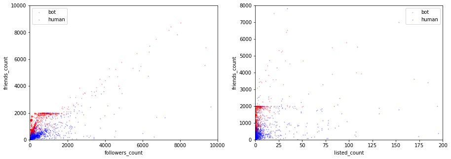
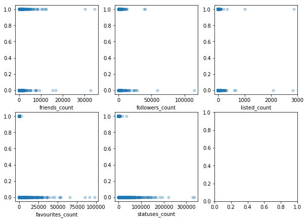

## 1. Introduction and Description of Data

test

| Dataset                 | Description                                             | Accounts | Tweets  | Year |
|-------------------------|---------------------------------------------------------|----------|---------|------|
| genuine accounts        |  Verified accounts that are human operated              | 3474     | 8377522 | 2011 |
| Social Spambots #1      | Retweeters of an Italian political candidate            | 991      | 1610176 | 2012 |
| Social Spambots #2      | Spammers of paid apps for mobile devices                | 3457     | 428542  | 2014 |
| Social Spambots #3      | Spammers of products on sale at Amazon.com              | 464      | 1418626 | 2011 |
| Traditional Spambots #1 | Training set of spammers used by Yang et al             | 1000     | 145094  | 2009 |
| Traditional Spambots #2 | Spammers of scam URLs                                   | 100      | 74957   | 2014 |
| Traditional Spambots #3 | Automated accounts spamming job offers                  | 433      | 5794931 | 2013 |
| Traditional Spambots #4 | Another group of automated accounts spamming job offers | 1128     | 133311  | 2009 |

## 2. EDA

After cleaning the data, we perform an initial analysis of the number of friends, number of followers and the number of lists the user is part of for both humans and bots. 

**Comments**
* Bots have significantly more friends than followers. It appears as if bots recklessly add as many friends as possible. This complements the theory on bots regarding bots existing primarily to tweet, re-tweet statuses which promote their agenda. This behavior is different from humans as humans (in ideak world) use twitter as a medium of exchange of information and are interested in both receiving and sending tweets.

* We find that humans, on average are part of more lists than bots. One interpretation can be that, humans have more agency and need to organize their followers into lists for easier and efficient consumption of information. Bots one can argue, have no need for any classification of  information. 

There are a couple of important observations to glean from this. First, it supplements the observations on friends_count, followers_count and listed_count made above. Second, the behavior of bots is starkly different from humans in favourites_counts and statuses_count. Bots mark nearly zero statuses as favorite and bots don’t tweet as well. 

We do a further breakdown of the five parameters for both, bot and human, to understand  how bots operate in the twitter space. 

This gives detailed information of how friends of bots differ from friends of humans. 

Between the two graphs above, we get a deeper understanding of how the bots really operate. From our analysis, the bot twitter space can be thought of as being divided into two distinct buckets, one with bots of 0 followers and one with bots of 0 statuses. The bots in the bucket of  0 followers tweet and retweet in line with their agenda. The other bucket, bots with 0 statuses don’t tweet however follow others and contribute the number of fake followers a user has.

Bots mark nearly zero statuses as favorite : how we understand this is, if bots exist to tweet or retweet their agenda or to increase the number of fake followers, they don’t need to mark statuses as favorite to do either. 

    
